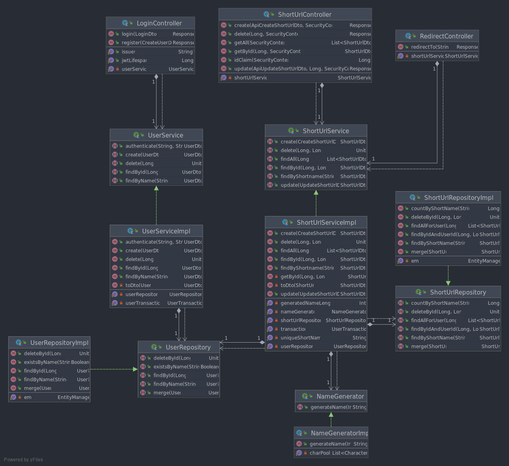

# Quarkus Java - Kotlin Comparison

The following outlines the difference of developing a Quarkus application in Java and Kotlin. For this purpose a URL
shortening service was implemented.

## Application

The implemented application to demonstrate the implementation differences is a URL shortening service.

### Architecture

The following image shows how the components of the application are connected



### Functionality

The core functionality is to create and use short links to other websites. This is achieved by mapping URLs to short
names. By navigating to the route with the short name, the server redirects the user to the mapped URI.

| Method | Routes | Description |
| -------- | -------- |-------- |
| GET |/{shortName}| Redirect to mapped URI|
| GET |/short-url/{id}| Get mapping by id|
| GET |/short-url| Get all mappings|
| POST |/short-url| Add a new mapping|
| PATCH |/short-url/{id}| Update a mapping, Premium only|
| DELETE |/short-url/{id}| Delete a new mapping, Premium only|

To create and view existing mappings, the user must be logged in. This is checked by providing a JWT token, which is
issued by the application. To obtain a token a simple login mechanism was implemented.

Users are separated in Premium and Free. The difference is that Free users cannot use update or delete mappings.

| Method | Routes | Description |
| -------- | -------- |-------- |
| POST |/register| Register a new User|
| POST |/login/{userName}| Authenticate User|

## Differences between Java and Kotlin

### Kotlin is cleaner

Kotlin tends to be less verbose and can produce more readable code. Especially when it comes to manipulation of
collections, the Kotlin standard library is more powerful and can solve problems easier and cleaner as demonstrated in
the code below.

#### Mapping Constraint Violations to an Error Response

##### Java

```java
return Response
        .status(Response.Status.BAD_REQUEST)
        .entity(new ErrorResponse(e.getConstraintViolations()
        .stream()
        .map(constraintViolation->{
        String lastElem="";
        for(Path.Node node:constraintViolation.getPropertyPath())
        lastElem=node.getName();
        return lastElem+" "+constraintViolation.getMessage();
        })
        .collect(Collectors.toList())))
        .build();
```

##### Kotlin

```kotlin
= Response.status(Response.Status.BAD_REQUEST)
    .entity(
        ErrorResponse.of(
            ex.constraintViolations.map { "${it.propertyPath.last()} ${it.message}" })
    )
    .build()
```

#### Generating a random Alphanumeric String

##### Java

```kotlin
@Override
public String generateName(int length) {
    StringBuilder sb = new StringBuilder(length);

    for (int i = 0; i < length; i++) {
    var index = (int)(characters.length() * Math.random());
    sb.append(characters.charAt(index));
}

    return sb.toString();
}
```

##### Kotlin

```kotlin
override fun generateName(length: Int): String =
    (1..length)
        .map { charPool.random() }
        .joinToString("")
```

### POJOs vs Data Classes

Domain Objects and DTOs in Java usually contain a lot of boilerplate code. Even though only fields are needed, getters,
setters and a constructer must be generated. In Kotlin, for this purposes data classes exists, which are a lot less
verbose than their Java counterpart. With the library Lombok, these data classes can be imitated in Java.

### Nullsafety

Checking for null can be very tedious but is often necessary to prevent errors. In Kotlin by default types cannot
be `null`. With this feature, possible null related errors can be detected at compile time. Lombok offers a `@NonNull`
Annotation, which imitates this feature. Examples for data classes with these features can be seen below.

#### Kotlin Data Class

```kotlin
data class UserDto(
    val name: String,
    val role: UserRole,
    val password: String,
    val id: Long?
)
```

#### Java Data Class with Lombok

```java

@Data
@AllArgsConstructor
public class UserDto {
    @NonNull
    private String name;
    @NonNull
    private UserRole role;
    @NonNull
    private String password;
    private Long id;
}
```

## "Readiness" of Kotlin of JarkartaaEE/Quarkus Development

The following sections outline if Kotlin is ready to be used with Quarkus.

### Kotlin NoArgs Plugins

Kotlin provides a very simple syntax for creating data classes (see example below). However, those do not work natively
with Quarkus since all Beans are required to have an empty constructor. Since this is a known issue there is a gradle
plugin called `org.jetbrains.kotlin.plugin.noarg` available, which generates an empty constructor at compile time.
However this plugin isn't included per default when creating a new Quarkus project, but must be added and configured
manually.

```kotlin
@Entity
data class ShortUrl(
    @field:NotBlank
    @field:URL
    var url: String,
    @field:Size(min = 2, max = 10)
    var shortName: String,
    var userId: String,
    @Id @GeneratedValue var id: Long? = null
)
```

### Kotlin Immutability

A core concept of Kotlin is immutability. The language has a special keyword `val` which marks variables as immutable.
Collections such as `List` and `Set` are immutable by default and mutability must be explicitly specified by using their
mutable counterparts. This is helps creating safer code since variables a guaranteed to stay the same after they have
been initialized.

However Quarkus does not fully benefit from the immutability of Kotlin, especially when defining data classes which are
used to model REST API requests and responses.

For example the following snippet displays the data class which is used to model the request object for creating a new
short url. As you can see are all properties required to be mutable. This is because Quarkus creates a new object using
the empty constructor and then sets the values using the property setters. Because of that it can't be guaranteed
that `url` is actually not `null` (Even though the type says it can't be `null`, it might be at runtime if the setter is
never called). For this reason it must be marked with `@field:NotNull` and additionally validated with the Java
validation API.

```kotlin
@NoArgs
data class ApiCreateShortUrlDto(
    var shortName: String?,
    @field:NotNull
    var url: String
)
```

### Configuration

Quarkus uses `application.properties` files for the configuration of the application. Those values can be injected with
the `@ConfigProperty(name = ... )` Annotation. Kotlin allows the definition of properties in the constructor. This
however does not work with the injection of config values, which results in empty field instead of an exception. Because
of this, those properties must be defined outside of the constructor as mutable variables (as seen in the snippet below)
. This is especially bad, since firstly the variable can then be changed later and secondly the variable must be
initialized with a default value.

```kotlin
@RequestScoped
class ShortUrlServiceImpl(
    @Inject private val shortUrlRepository: ShortUrlRepository,
    @Inject private val nameGenerator: NameGenerator,
    @Inject private val transaction: UserTransaction,
) : ShortUrlService {

    @ConfigProperty(name = "urlshortener.generatedNameLength")
    private var generatedNameLength: Int = 0

    ...
}
```

### JPA Queries

While JPA provides a very nice API for creating database queries, it is not fully compatible with Kotlin as of right
now. When returning a built in type from a `TypedQuery` such as a string or a number the Java class must be provided
instead of the Kotlin class as seen in the example below. This is not only cumbersome but also leads to a compiler
warning. In the example below the method `.toLong` is used to convert it to the Java primitive type `long` which is
equivalent to the Kotlin `Long` type.

```kotlin
import java.lang.Long as JavaLong

em.createQuery(
    "select count(s) from ShortUrl s where s.shortName = :shortName",
    JavaLong::class.java
).run {
    setParameter("shortName", shortName)
    singleResult.toLong()
}
```

### Checked Exceptions

The usefulness of checked exceptions is a hotly discussed topic, some consider them useful while others despise them.
Apparently does the Kotlin team think the latter since Kotlin has no checked exceptions (To stay compatible with Java
methods can be annotated with `@Throws` to mimics the `throws` keyword in Java). This however leads to some strange
behavior when developing a Quarkus application. For example if a method throws a checked exception which is not declared
Quarkus wraps it in a `ArcUndeclaredThrowableException`. Since this is not very well documented, it took some additional
development time to figure out how to solve this.

## Conclusion

Kotlin certainly offers some nice advantages, most of which can be utilized with Quarkus. However when developing a
Quarkus application one will face some language specific problems, which are not too well documented. In the end the
developer has to decide for himself if the benefits of Kotlin outweight the shortcommings.